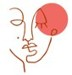

# 🎯 Progetto PPM – Progettazione e Produzione Multimediale 



**Autore:** Lorenzo Mugnai – 2022  

## 📌 Informazioni sul progetto

PPM è un'applicazione multiplayer che propone un gioco a puntamento naturale.  
Due utenti devono individuare il prima possibile un particolare presente in un'opera d'arte.  
L’interazione è completamente gestita con i movimenti della mano.

---

## 🛠️ Linguaggi Utilizzati

- **Frontend**: HTML, CSS, JavaScript  
- **Backend**: Node.js con Socket.IO  
- **Interazione Naturale**: [MediaPipe Hands](https://google.github.io/mediapipe/solutions/hands.html)

---

## 📅 Agenda

- [📋 Regolamento](#📋-regolamento)
- [⚙️ Implementazione](#⚙️-implementazione)
- [🖼️ Gestione dei Quadri](#🖼️-gestione-dei-quadri)
- [🎥 Demo](#🎥-demo)

---

## 📋 Regolamento

### 👤 Accesso  
Dopo aver inserito l'**username**, l’utente può:
- 🔓 **Unirsi a una partita pubblica** (l’app trova automaticamente un avversario)
- 🔐 **Unirsi a una partita privata** (entrambi devono inserire lo stesso codice)

### 🕹️ Modalità di gioco  
- L'applicazione mostra la **stessa immagine** a entrambi i giocatori.
- Il titolo suggerisce **quale particolare cercare**.
- I giocatori devono **puntare con la mano** sulla zona giusta e mantenerla per 3 secondi.
- Vince chi trova per primo il dettaglio corretto.

---

## ⚙️ Implementazione

### 🖥️ Frontend  
Gestisce l’interazione con l’utente e il tracciamento della mano tramite:
- **MediaPipe Hands**, libreria che riconosce in tempo reale la forma e i movimenti delle mani.

### 🌐 Backend  
Basato su **Node.js**, consente:
- Connessione simultanea di due giocatori.
- Comunicazione in tempo reale con **Socket.IO**.
- Gestione dei turni e dei punteggi.
- Salvataggio e modifica del file `quadri.json`.

---

## 🖼️ Gestione dei Quadri

### ➕ Aggiunta  
Ogni opera contiene:
- Titolo  
- Descrizione del personaggio da trovare  
- Descrizione post-vittoria  
- Coordinate del particolare  
- Immagine dell’opera  

### 🗃️ Salvataggio  
Tutti i dati sono salvati in `quadri.json`  
Le immagini sono caricate su **Firebase Storage**.

### 🗑️ Rimozione  
I quadri possono essere eliminati dalla sezione “Gestione”.

---

## 🎥 Demo

### ▶️ Accesso Pubblico  
[](Accesso%20Pubblico.mp4)

### ▶️ Accesso Privato  
[](Accesso%20Privato.mp4)

### ▶️ Tracciamento mani con MediaPipe  
[](MediaPipe.mp4)

---

## 🚀 Avvio del progetto

1. Clona il repository  
2. Installa le dipendenze:
   ```bash
   npm install
3. Avviare il server
     ```bash
      node server.js
4. Aprire il browser su http://localhost:3000
